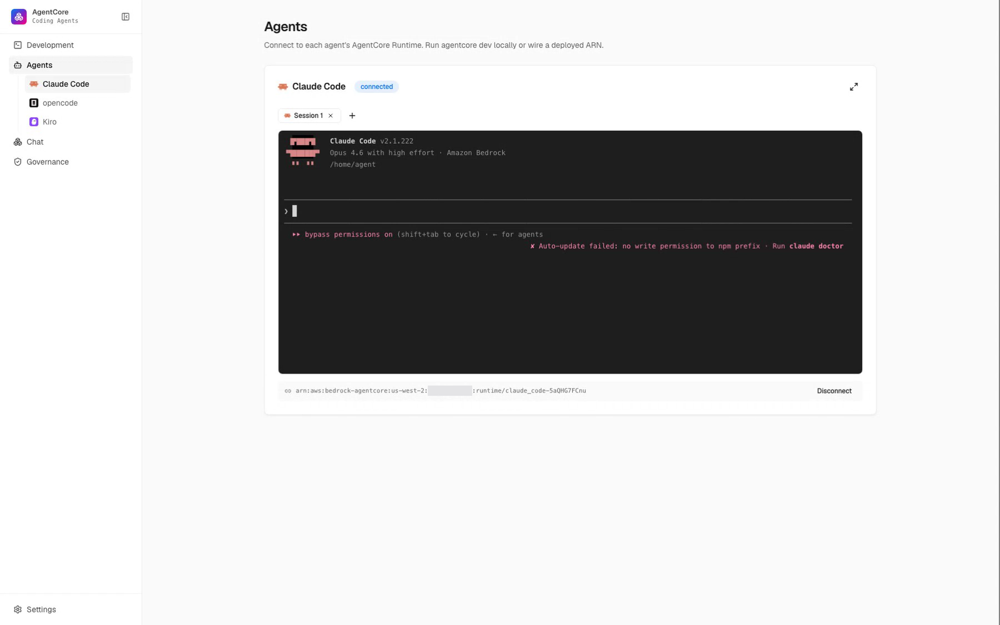

# Coding Agents on Amazon Bedrock AgentCore Runtime

[](docs/media/console-walkthrough.mp4)

*A prior real deployment showing the served roles and a Runtime session.
Navigation and the current Attribution view have changed since this recording.
[Play the earlier walkthrough (22s)](docs/media/console-walkthrough.mp4).*

Run Claude Code (backend), opencode (frontend), and Kiro (validator) on Amazon
Bedrock AgentCore Runtime. Give the team one request; each selected builder opens
its own checked and reviewed pull request. The guided game selects Claude Code
and Kiro, producing one builder PR. A separate Claude Code validator remains a
restore path: deploy and wire it, then select it with `WORKSHOP_ROLES`.

Each builder works in a named linked Git worktree and separate pull request. The
worktree is local to the coordinator or Runtime; only one normalized source archive
crosses the Runtime boundary. The validator writes an executable for that request,
and the orchestrator runs it. One independent,
read-only review then applies two required lenses to each pull request on its own:
adversarial verification and design/integration. The reviewer never sees a
builder's conversation or edits a builder's code.

This repo is the full code payload. Clone it and follow the workshop content.
Labs 1 and 2 use the prepared host terminal; Lab 3 uses Development, Agents, and
Governance in the console. The underlying commands and query remain inspectable.

> **Current project-language support:** Python and Node.js 22
> (JavaScript/TypeScript). Add the required toolchain to
> `orchestrator-agent/Dockerfile` before using another language, because that
> container executes the validator's check.

This repository is the single source of truth for all demo and harness **code**. The
matching Workshop Studio teaching content (guided lab pages and the CloudFormation
template) is published on Workshop Studio; the CloudFormation bootstrap clones this
repository directly into the box home, so the customer-reproducible path is exactly a
`git clone` of this URL (which yields `~/sample-amazon-bedrock-agentcore-coding-agents`)
followed by the CLI steps the workshop teaches.

In Lab 2, create a separate **private GitHub repository** for the app your agents
will build. Choose **No template** and turn **Add README** on so it has an initial
commit and default branch. This platform repository stays in the workshop's VS Code
checkout. Each builder opens ONE role pull request against the app
repository's default branch, and each pull request is checked and reviewed
on its own. Under the default `human_review` policy, an approved PR stays open
for a person to merge. There is no combined candidate, merge queue, or separate final
pull request. The validator's executable must pass for each pull request, run
against the default branch as it stands plus that diff. The GitHub App authors every
pull request.

Builders begin independently from the same shared plan. Because each pull request is
checked and reviewed against the default branch AS IT STANDS, once an earlier role's
pull request merges the next role's check runs against a tree that already contains
it. When that merge moves a path a still-open pull request also changed, its owner
gets one bounded refresh. This catches cases where separate branches each worked but
did not agree with each other. It is separate from the one repair allowed after a
failed check or review finding.

Lab 2 deliberately keeps Git metadata off S3 Files. The deployed coordinator uses
`/tmp/workshop-runs`, each coding-agent Runtime creates its turn's worktree under
`/tmp`, and `.git` never enters the exchange archive. S3 Files remains the shared
workspace for direct shell work in Lab 1. The host, deployed coordinator, and
run-state reader use the bucket recorded in `coding-agents/infra.config`, including
stack-specific bucket names; `WORKSHOP_RUNTIME_BUCKET` remains an explicit override.

## Layout

- `coding-agents/` the three coding-agent harnesses (container + setup.sh + deploy.py + connect.py) and shared infra/gateway
  - `claude-code/` backend builder (Claude Code, native Bedrock)
  - `opencode/` frontend builder (opencode, native Bedrock)
  - `kiro/` acceptance-contract validator (Kiro CLI; steered by `.kiro/steering/*.md` with `inclusion: always`, which directs it to author an executable check whose exit code is the gate; authenticates with your own `ksk_` key, fetched from the AgentCore Identity Token Vault at session start)
  - `claude-code-validator/` restore path (hidden; kept restorable like `codex/`, not on the served roster by default): the same acceptance-check-authoring contract in a `CLAUDE.md`, Bedrock-native with no key, for an account without a Kiro subscription
- `orchestrator/` the Strands orchestrator engine (routing, engine, executor, reviewer, github)
  - `orchestrator/roles.py` declares the served roster (`WORKSHOP_ROLES`-configurable); this is the single place role ids, kinds (builder/checker), and capabilities (backend/frontend/validator) live
- `orchestrator-agent/` the deployable Strands agent bundle
- `console/` the React + FastAPI console (Development / Agents / Chat / Governance / Settings)
- `interactive-api/` `metrics-api/` the Stage 1 interactive + Stage 3 metrics engines
- `harness-skills/` agent skills used to configure the harnesses
- `e2e/` the end-to-end workshop journey + integration suite

## Tests

The full suite is collected from this repo root:

```bash
WORKSHOP_SKIP_LIVE=1 WORKSHOP_E2E_LIVE=0 python3 -m pytest -q
npm --prefix console/web run typecheck
npm --prefix console/web test
npm --prefix console/web run build
```

`pytest.ini` declares the `testpaths`; the root `conftest.py` isolates GitHub and
Runtime credentials so no test can read a token or open a pull request.
The offline suite verifies platform behavior, not a future agent-generated
application. A fresh event run still needs its real executable and review
evidence. Lab 3's identity mapping intentionally ships empty; its completion
tests require `WORKSHOP_LAB3_COMPLETE=1` after the attendee implements it.

## When something is not working

Both collect no credentials and are safe to re-run:

```bash
python3 orchestrator/github.py doctor   # can the GitHub App reach YOUR repo?
python3 orchestrator/diagnose.py        # roles wired, gateway, recent verdicts
python3 orchestrator/diagnose.py <run_id>   # + that run's engine-log tail
```

Run `doctor` BEFORE deploying the coordinator. The mistakes that cost the most time
(an App installed on a different repository, a wrong owner in `GITHUB_REPO`) all pass
a plain gateway health check and then fail when a build tries to write, after the
agents have already run. `diagnose.py` invokes the same GitHub doctor check.
To prove write permission, that check idempotently resets the
`workshop/doctor` branch; it writes no file and opens no pull request.

Every finished run also persists its verdict, so `run_status <run_id>` still answers
from a NEW coordinator session, and `list_runs` finds it when the run id is lost.

## Gotchas worth knowing before you debug

Each of these cost real time on a live run, and each has a cheap tell.

- **opencode needs a pseudo-terminal.** Version 1.17.20's default formatter blocks when
  stdout is not a tty, so a non-PTY invocation hangs with no output, no error and almost
  no CPU, its debug log stopping right after `init`. The served paths already run it in a
  PTY (`agentcore exec --it`, and a Runtime PTY per dispatched turn). Preserve
  that PTY in served paths.
- **Enabling Claude Code telemetry is not exporting it.** A dispatched run gets seven
  variables from `_CLAUDE_TELEMETRY` in `orchestrator/roles.py`. With only
  `CLAUDE_CODE_ENABLE_TELEMETRY=1` the CLI collects and sends nowhere, and Logs Insights
  stays empty. Check the sidecar too: inside the Runtime,
  `curl -fsS http://127.0.0.1:13133` answers `"status":"Server available"`.
- **Only stage steering a role actually reads.** Everything under `/mnt/s3files` is
  visible to every role whose launcher works there, including the validator. Claude Code
  keeps `$HOME` in a hand-opened shell and reads its baked `CLAUDE.md`; opencode and Kiro
  pick `/mnt/s3files` when steering is there.
- **A session id must be at least 33 characters**, which is why every example generates a
  UUID. And `.bashrc` exports reach interactive shells only, so scripted runs must pass
  the environment explicitly.
- **Trust the pull request, not the chat turn.** The coordinator's prose is a model
  summarising state and can overstate; `role_prs`, `gate_history`, `review_rounds`,
  `fail_reason` and `next_action` are what the engine recorded.
- **You cannot create a GitHub App from an API.** `coding-agents/gateway_mcp/create-github-app.py`
  automates everything around it (manifest, redirect, conversion, installation id
  discovery), but a human still presses **Create GitHub App** and installs it. Adding a
  new repository to an App installation you own also needs a browser: a user token gets
  `403 You do not have permission to modify this app`.

## License

MIT-0. See `LICENSE`.
