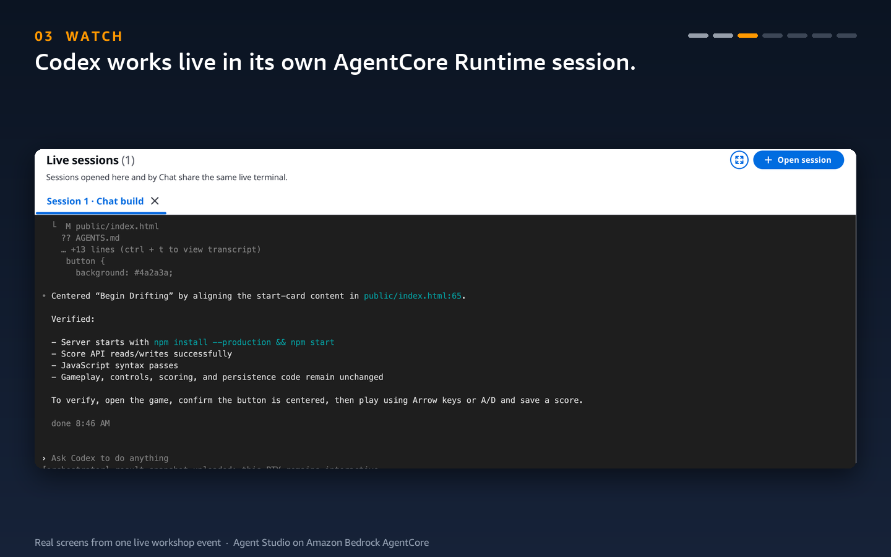
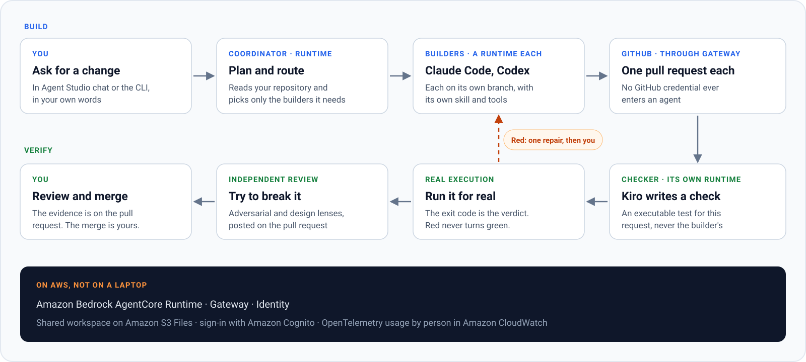
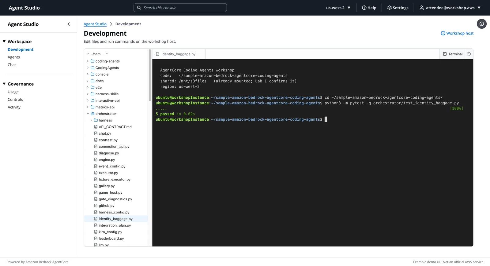
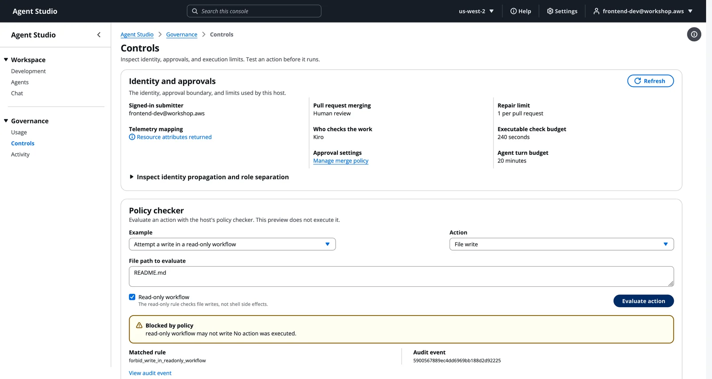
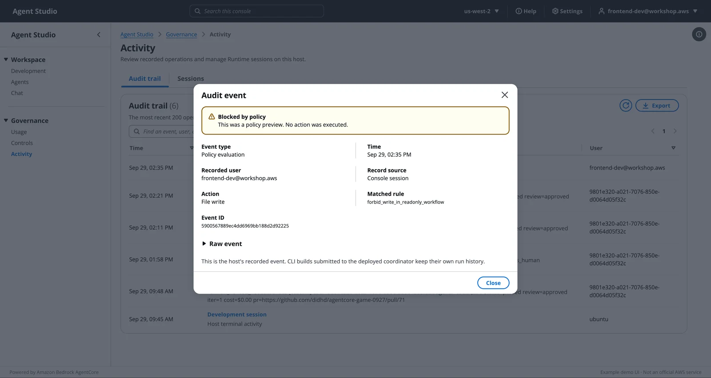
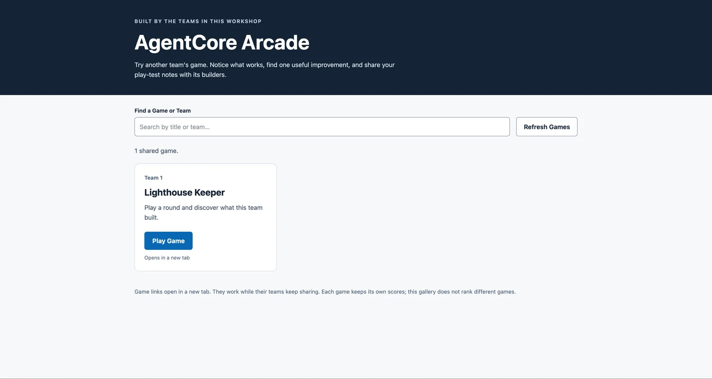

<div align="center">

# Coding Agents on Amazon Bedrock AgentCore

**Stop prompting agents task by task. Build the loop that ships the work.**

Claude Code, Codex, and Kiro work as one team on AWS.<br>
You ask for a change. You get back a pull request that a separate agent tested<br>
and an independent review read. Then you decide whether to merge.

[Get started](#get-started) · [How it works](#how-it-works) · [Agent Studio](#agent-studio) · [Operator notes](docs/operators.md)

<sub>The code behind the AWS re:Invent 2026 workshop <b>AIM416: Scale your coding agents beyond the laptop with AgentCore</b></sub>

</div>

<p align="center">
  <picture>
    <source media="(prefers-reduced-motion: reduce)" srcset="docs/assets/demo-poster.png">
    <source type="image/webp" srcset="docs/assets/demo.webp">
    
  </picture>
</p>
<p align="center"><sub>Real screens from one live workshop event, in loop order. Nothing is mocked.</sub></p>

## Why this exists

A coding agent on a laptop is one person, one session, one machine. A team needs
more: agents that run where everyone can reach them, work that is checked by
something other than the agent that wrote it, and a record of who asked for what.
This repository is a complete, working example of that on Amazon Bedrock AgentCore.

## The idea: build the loop

**Discover → Plan → Execute → Verify → Iterate.** You stop steering each step and
build the loop that does it. A loop is only as good as its verify step, so every
choice here protects it.

- **The maker is never the checker.** Builders write code. A different agent, in its
  own Runtime with its own instructions, decides whether it works.
- **Verification is real execution.** The checker writes an executable test for
  *your* request. The engine runs it and reads the exit code. A red check never
  turns green, and no result is ever faked.
- **Bounded, then a human.** A failed check goes back to the builder that owns it
  once, on the same pull request. Then the loop stops and hands you the evidence.
- **Skills, not scripts.** Agents read principle-based skills and choose their own
  files, language, and structure. Nothing in this repository encodes the answer.
- **Memory outside the chat.** Every build leaves pull requests, check results, and
  a saved record, so the next loop starts where the last one stopped.

## How it works

<p align="center"></p>

- **A team, not a single tool.** Claude Code builds services, Codex builds
  interfaces, and Kiro checks the work. Each runs in its own AgentCore Runtime
  session, sharing an Amazon S3 Files workspace. Choose a different roster with one
  setting, no code change.
- **A coordinator that keeps working.** A Strands agent on AgentCore Runtime reads
  your repository, sends work only to the builders a request needs, and finishes
  the build after you close your laptop.
- **GitHub without handing out keys.** A GitHub App sits behind AgentCore Gateway.
  Agents get pull requests, never a GitHub credential. Kiro's key stays in
  AgentCore Identity.
- **Who asked, and what it used.** People sign in with Amazon Cognito. Their
  identity travels with the work into OpenTelemetry, so Amazon CloudWatch shows
  usage per person and per agent.

## Agent Studio

A browser console for the whole loop, included in [`console/`](console). Labs 1
and 2 use the terminal; Lab 3 brings the same work into Agent Studio.

| Workspace | Governance |
|---|---|
| **Chat** · ask, plan, and follow each build to its pull request | **Usage** · token usage by agent and by person, from CloudWatch |
| **Agents** · open a live terminal in any agent's Runtime session, or watch the one Chat started | **Controls** · identity, role boundaries, merge policy, and a policy checker |
| **Development** · edit files and run commands on the workshop host | **Activity** · an audit trail of decisions, and every Runtime session |

<details>
<summary><b>See more screens</b></summary>
<br>

**Development.** The workshop host in your browser: files, editor, and a terminal.



**Controls.** Who is signed in, who checks the work, the merge and repair limits, and a policy check that blocked a write without running it.



**Activity.** The audit record for that decision: who, which rule, and that nothing was executed.



**Event gallery.** Teams publish what their agents built so the room can play it.



</details>

## Get started

**At AWS re:Invent 2026 (AIM416) or another AWS event:** your account, a
browser-based VS Code, and this repository are ready. Open the workshop and start
at Lab 1.

**In your own AWS account:** launch the workshop stack in one region, then follow
the same labs. You need Amazon Bedrock model access, a GitHub account, and a Kiro
subscription for the checker.

<p>
  <a href="https://us-west-2.console.aws.amazon.com/cloudformation/home?region=us-west-2#/stacks/create/review?templateURL=https://ws-assets-prod-iad-r-pdx-f3b3f9f1a7d6a3d0.s3.us-west-2.amazonaws.com/7b1cc169-b7a2-4a64-b215-df050bd8c8f1/cfn.yaml&stackName=coding-agents-workshop&param_AssetsBucketName=ws-assets-prod-iad-r-pdx-f3b3f9f1a7d6a3d0&param_AssetsBucketPrefix=7b1cc169-b7a2-4a64-b215-df050bd8c8f1"></a>&nbsp; US West (Oregon), recommended<br>
  <a href="https://us-east-1.console.aws.amazon.com/cloudformation/home?region=us-east-1#/stacks/create/review?templateURL=https://ws-assets-prod-iad-r-iad-ed304a55c2ca1aee.s3.us-east-1.amazonaws.com/7b1cc169-b7a2-4a64-b215-df050bd8c8f1/cfn.yaml&stackName=coding-agents-workshop&param_AssetsBucketName=ws-assets-prod-iad-r-iad-ed304a55c2ca1aee&param_AssetsBucketPrefix=7b1cc169-b7a2-4a64-b215-df050bd8c8f1"></a>&nbsp; US East (N. Virginia)
</p>

| Lab | You do | You learn |
|---|---|---|
| **1. Build your coding team** | Deploy Claude Code to AgentCore Runtime, then open a shell in each agent | Agents on Runtime, one shared workspace, keys kept in AgentCore Identity |
| **2. Coordinate a build** | Connect GitHub, deploy the coordinator, ask for a game, then play it | The loop: one pull request per builder, a real check, an independent review |
| **3. Improve and govern** | Turn a play-test note into a fix from Agent Studio, then trace it | Identity and usage per person, policy checks, and the audit trail |

Lost at any point? One read-only command says where you are and what to run next:

```bash
python3 orchestrator/progress.py
```

In your own account, finish with the workshop's cleanup steps. The Runtimes you
deploy in the labs are not part of the stack, and the host, Runtimes, Gateway, and
NAT gateway are billed while they exist.

## What's in the repository

| Folder | What it holds |
|---|---|
| [`coding-agents/`](coding-agents) | One folder per agent (container, steering, deploy and connect), plus the GitHub Gateway |
| [`orchestrator/`](orchestrator) | The loop: routing, dispatch, checks, review, GitHub, and saved run records |
| [`orchestrator-agent/`](orchestrator-agent) | The coordinator, packaged for AgentCore Runtime |
| [`console/`](console) | Agent Studio (React and FastAPI) |
| [`harness-skills/`](harness-skills) | The skills each agent reads |
| [`interactive-api/`](interactive-api), [`metrics-api/`](metrics-api) | Terminal sessions and usage queries behind the console |
| [`e2e/`](e2e) | Journey and integration tests |

Pins, tests, troubleshooting, and hard-won gotchas are in
[docs/operators.md](docs/operators.md).

## Security

This is sample code for learning. Agent Studio is an example UI, not an AWS
service. Review IAM scope, networking, and data handling before using any of it
in production. To report a security issue, use
[AWS vulnerability reporting](https://aws.amazon.com/security/vulnerability-reporting/)
rather than a public issue. See [CONTRIBUTING](CONTRIBUTING.md).

## License

MIT-0. See [LICENSE](LICENSE).
